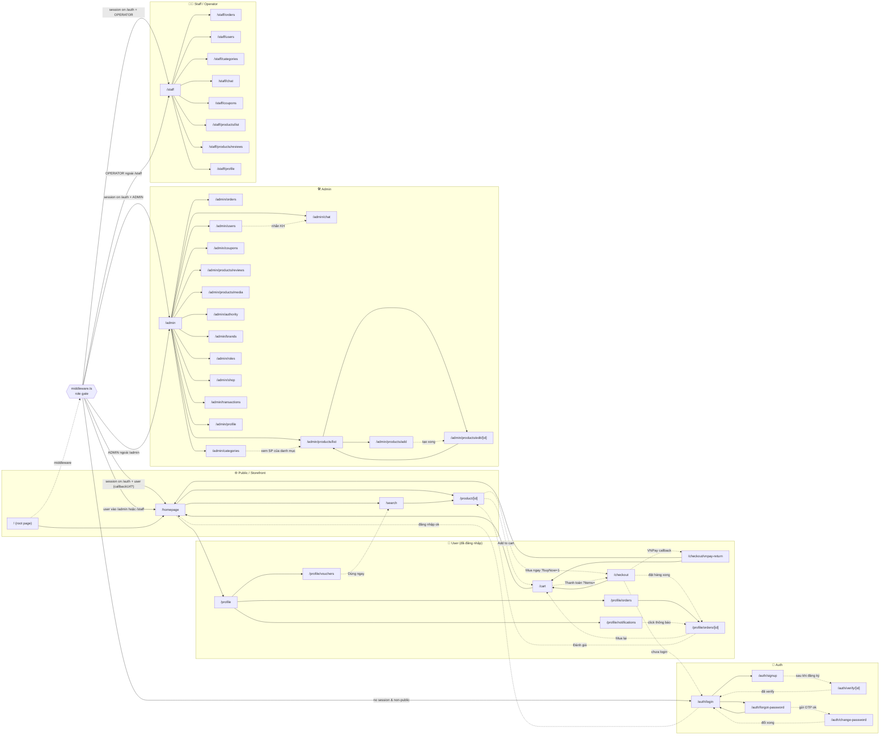
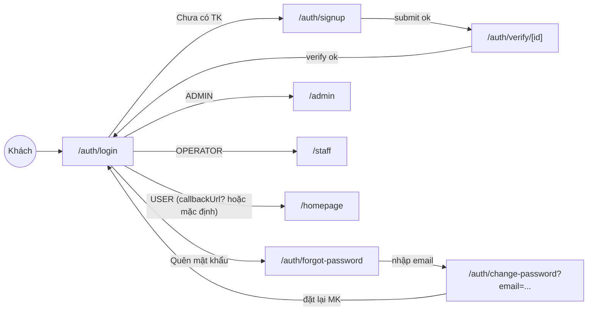
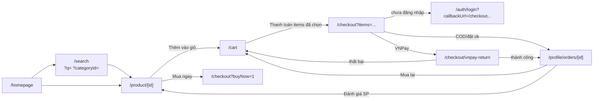

# Sơ đồ luồng ứng dụng (App Flow Diagram)

Tổng hợp toàn bộ điều hướng giữa các trang ở frontend (`fe-ecomerce-shop/src/app`).
Nguồn dữ liệu: thẻ `<Link href=...>`, `router.push/replace(...)` và `src/middleware.ts`.

> Quy ước: viền liền = `<Link>` tĩnh • viền nét đứt = `router.push` trong code • mũi tên có nhãn = điều kiện / query string • cụm "Middleware" = redirect tự động theo role.

## 1. Toàn cảnh — phân vùng theo role

## 2. Luồng Auth (chi tiết)

## 3. Luồng mua hàng (Storefront → Order)

## 4. Bảng route đầy đủ

| Vùng | Route | Ghi chú |
|---|---|---|
| Public | `/`, `/homepage`, `/search`, `/product/[id]` | middleware coi là public |
| Auth | `/auth/login`, `/auth/signup`, `/auth/verify/[id]`, `/auth/forgot-password`, `/auth/change-password` | đã login sẽ bị redirect khỏi đây |
| User | `/cart`, `/checkout`, `/checkout/vnpay-return`, `/profile`, `/profile/notifications`, `/profile/orders`, `/profile/orders/[id]`, `/profile/vouchers` | yêu cầu session |
| Admin | `/admin`, `/admin/orders`, `/admin/users`, `/admin/categories`, `/admin/chat`, `/admin/coupons`, `/admin/products/{list,add,edit/[id],reviews,media}`, `/admin/authority`, `/admin/brands`, `/admin/roles`, `/admin/shop`, `/admin/transactions`, `/admin/profile` | role `ADMIN` |
| Staff | `/staff`, `/staff/orders`, `/staff/users`, `/staff/categories`, `/staff/chat`, `/staff/coupons`, `/staff/products/{list,reviews}`, `/staff/profile` | role `OPERATOR` |

## 5. Nguồn điều hướng chính

- **Navbar** (`components/header/Navbar.tsx`) — links tới `/homepage`, `/search`, `/search?categoryId=`, `/profile*`, `/auth/login`, `/auth/signup`
- **Admin sidebar** (`app/admin/sidebar.tsx`) — toàn bộ mục admin
- **Staff sidebar** (`app/staff/sidebar.tsx`) — toàn bộ mục staff
- **ProductCard** (`components/product/ProductCard.tsx`) → `/product/[id]`
- **ProductInfo** (`components/product/ProductInfo.tsx`) → `/cart`, `/checkout?buyNow=1`
- **Cart page** → `/checkout?items=...`
- **Checkout page** → `/auth/login?callbackUrl=`, `/profile/orders/[id]`, `/cart`
- **VNPay return** → `/homepage`, `/cart`
- **OrdersContent / BuyAgainButton / ReviewOrderDialog** → `/profile/orders/[id]`, `/cart`, `/product/[id]#reviews`
- **CategoriesClient** (admin) → `/admin/products/list?categoryId=`
- **AdminUsersClient** → `/admin/chat?room=`
- **middleware.ts** — gate role: thực hiện hầu hết redirect cross-area
